# Lab 02 - Integrate Logic App with Threat Protection and XDR

## Estimated Duration: 120 minutes

The integration of a Logic App with Threat Protection involves configuring triggers and actions to receive alerts, while interaction with XDR solutions requires adding actions to exchange data, perform analyses, and trigger responses. Implementing conditional checks and logic within the Logic App allows for tailored handling of received threat information, ensuring effective responses and workflow execution before thorough testing and deployment to production environments. 

## Lab objectives
 In this lab, you will perform the following:
 - Task 1: Connect the Windows security event connector
 - Task 2: Enable Microsoft Defender for Cloud
 - Task 3: Create a Security Operations Center Team in Microsoft Teams
 - Task 4: Create a Playbook in Microsoft Sentinel
 - Task 5: Update a Playbook in Microsoft Sentinel
 - Task 6 : Onboard a Device
 

## Architecture Diagram
 

### Task 1: Connect the Windows security event connector

In this task, you'll set up the connector to ensure effective log transmission and enhance your security monitoring framework.

1. In the Search bar of the Azure portal, type **Microsoft Sentinel (1)**, then select **Microsoft Sentinel (2)**.

    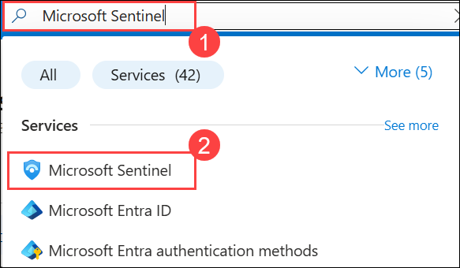 

1. Select the pre-created Sentinel **loganalyticworkspace** from the available list.

     

1. On the **Data connectors (1)**, In the search bar type **windows security events (2)**, **Go to content hub (3)**

   >**Note**: If you do not see the  page in the Microsoft Sentinel portal, try refreshing the browser. Wait 5 minutes and refresh again until it appears.

   
   
1. Navigate to the left menu and go to the **Content Management** section; there, select **Content Hub (1)**. On the Content Hub page, locate **Windows Security Events (2)**, and then **select (3)** it. Finally, click on **Install (4)**.

      

1. After receiving the notification of a successful installation, return to the Data Connector page and click on the refresh button to ensure that the changes take effect.

1. You should observe two options: **Security Events Via Legacy Agent** and **Windows Security Event Via AMA**.

1. Choose **Security Events Via Legacy Agent**, and then click on **Open Connector Page**.

     
   
8. In the configuration section, opt for **Install Agent on Azure Windows Virtual Machine (1)**, and then choose **Download & Install Agent for Azure Windows Virtual Machines (2)**.

     

9. Select the **svm-<inject key="DeploymentID" enableCopy="false" />** virtual machine and click on connect.

     
        
10. Once **connected (1)**, select the **Virtual Machine (2)** link from the top.

     

11. On the virtual machine page select the **s2vm-<inject key="DeploymentID" enableCopy="false" />** virtual machine and click on connect. wait until get connected.

    

11. Then, come back to the Configuration and scroll down a bit. You can find **Select which events to stream**. Click on **All Events**.

     

12. Click on Apply Changes now. If you refresh the data connector page, you can see the status Connected for **Security Events Via Legacy Agent**.

### Task 2: Enable Microsoft Defender for Cloud

In this task, you will enable and configure Microsoft Defender for Cloud.

1. In the search bar of the Azure portal, type **Defender (1)**, then select **Microsoft Defender for Cloud (2)**.

    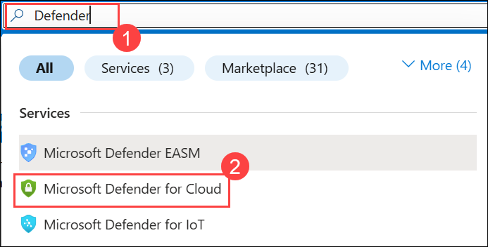 

1. When prompted, click **Enable** to activate Defender CSPM.
     
   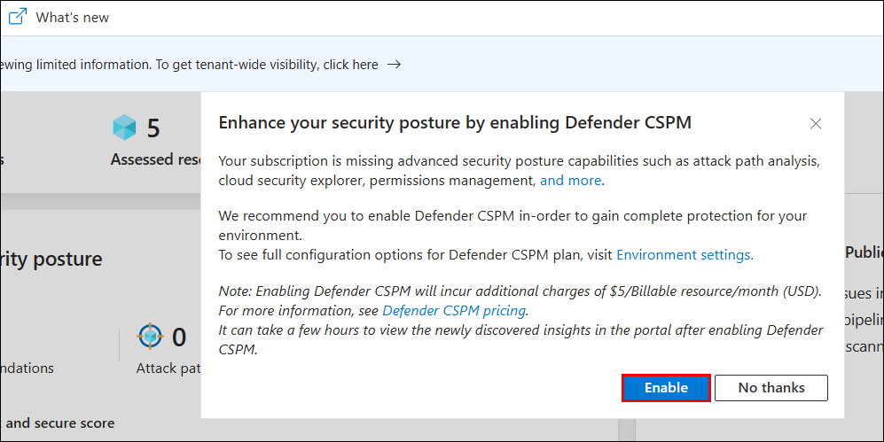

   > **Note:** If you don’t see the pop-up prompt, simply continue and follow the lab guide steps as shown below.

   >**Note:** This enables advanced posture capabilities like attack path analysis and permissions management.

1. In the **Microsoft Defender for Cloud** page, under **Management**, select **Environment settings (1)**, expand **Azure** and **Tenant Root Group**, then select **Subscription (2)**.

   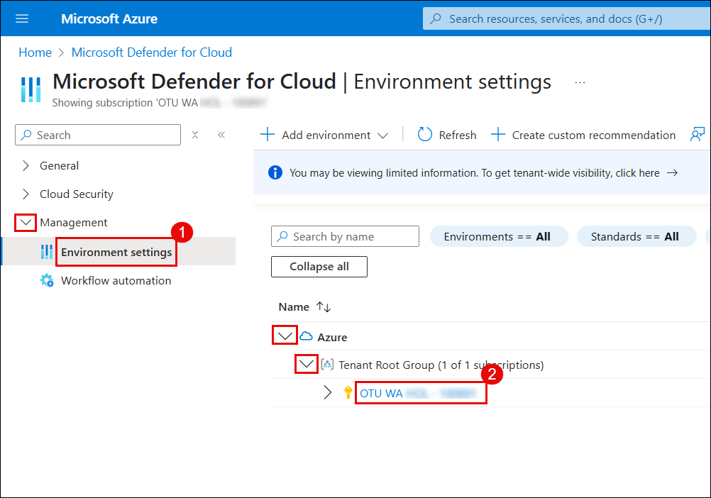

1. On the **Settings & monitoring** page, turn **On (1)** the toggle for **Foundational CSPM** and **On (2)** for **Servers** under Cloud Workload Protection, then click **Save (3)**.

   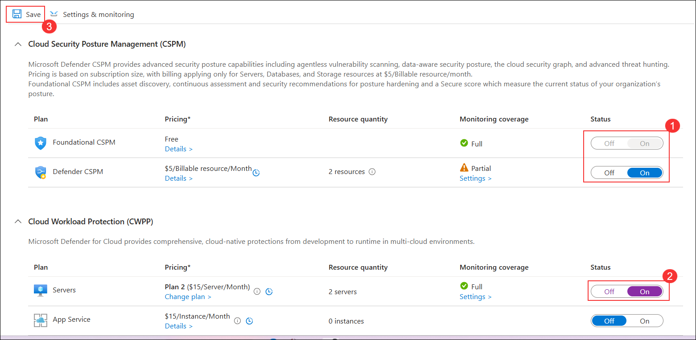

1. Click **Environment settings** in the top to return to the environment settings page.

   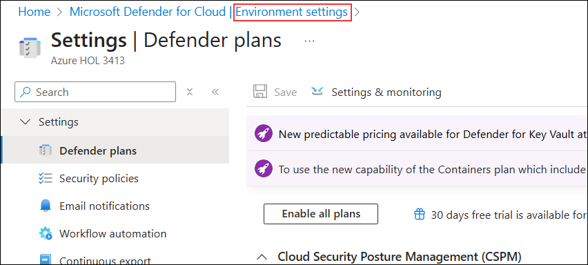

1. On the **Environment settings** page, expand **your subscription (1)**, and select **loganalycticworkspace (2)**.

   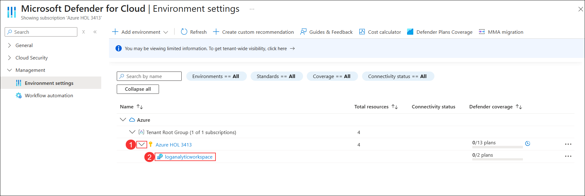

1. On the **Select Defender plan** page, turn **On (1)** the toggles for **Foundational CSPM** and **Servers**, then click **Save (2)**.

   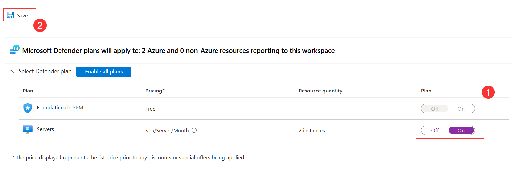

1. Close the Defender plans page by selecting the 'X' in the upper right corner of the page to return to the **Environment settings**.

### Task 3: Create a Security Operations Center Team in Microsoft Teams.

In this task, you will create a team in Microsoft Teams for use in the lab.  

1. Search to the teams Portal **https://teams.microsoft.com/v2/** on browser, proceed to log in using the following credentials:

   - **Email/Username:** <inject key="AzureAdUserEmail"></inject>
   - **Password:** <inject key="AzureAdUserPassword"></inject>

1. To create a new team in Microsoft Teams, click the **dropdown arrow (1)** next to the Chat header, then select **New team (2)** from the menu.

    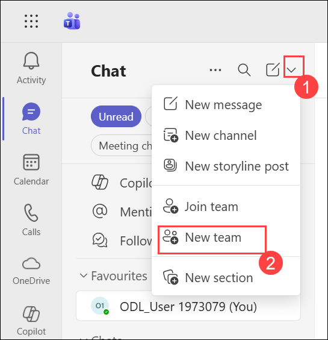 

1. Enter **SOC (1)** as team name, keep Team type as **Private (2)**, and **New Alerts(3)** as First channel name , then click **Create (4)**.

    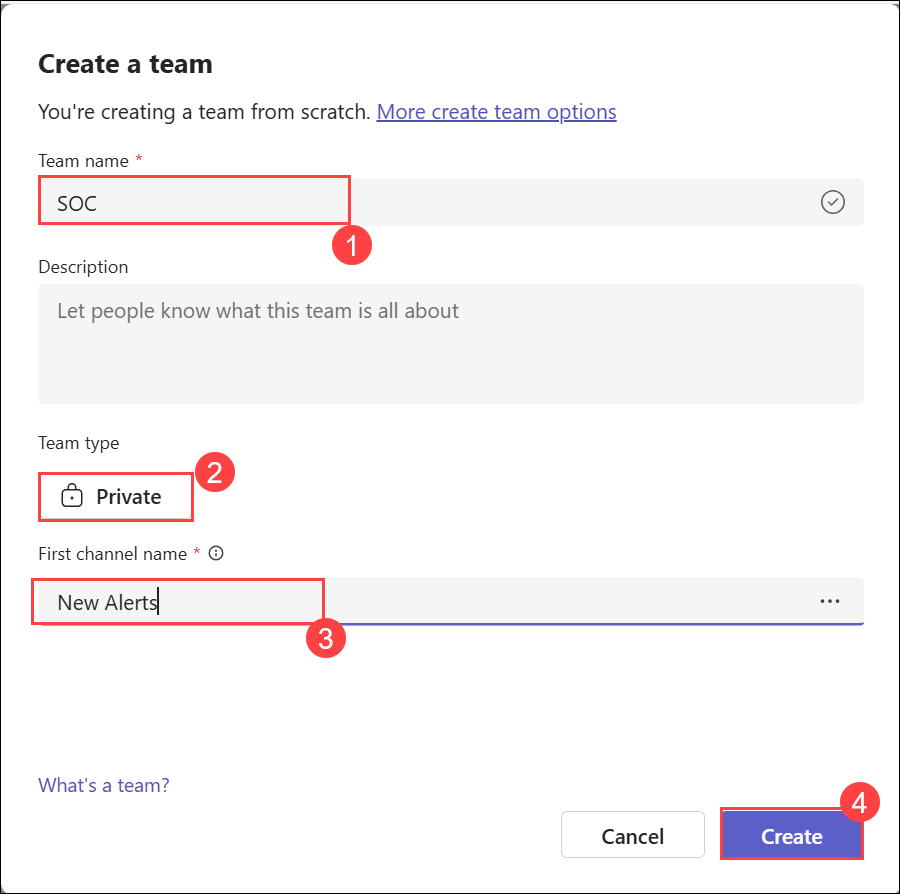  

     

1. In the Add members to SOC screen, select the **Skip** button.

   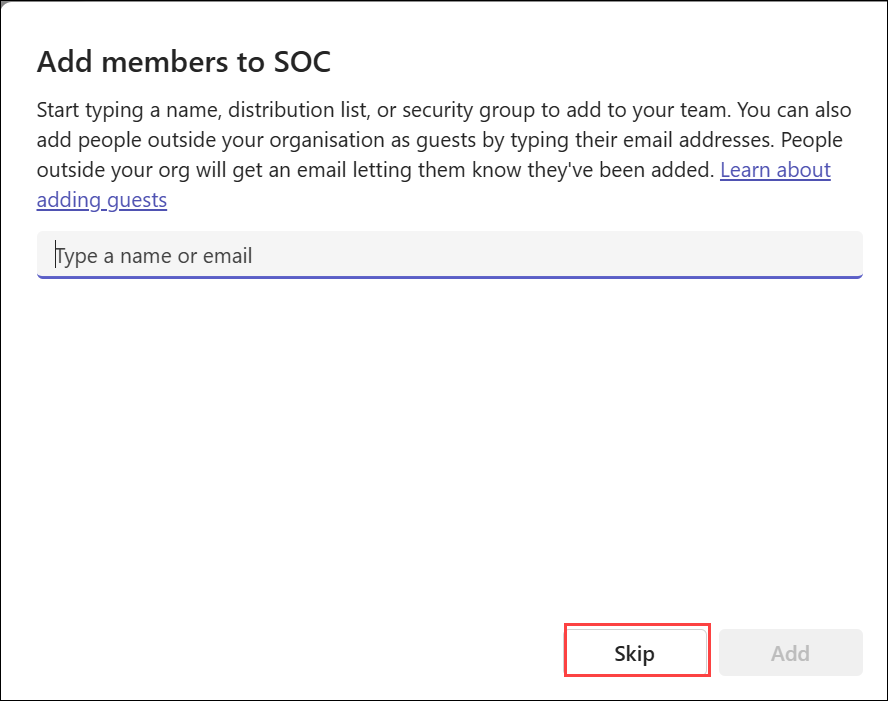

1. Scroll down the Teams blade to locate the newly created SOC team, select the ellipsis **(...)** on the right side of the name and select **Add channel**.
   
     

1. Enter a channel name as **New Alerts** then select Choose a channel type to **Private** and click on **create** button.

1. Hover over the **SO**, New Alerts channel name that appears, select **Copy link** (or "Copy link to channel"), then paste it into WordPad.

   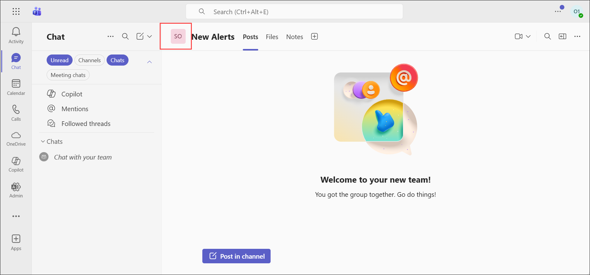

1. Note down the **Channel ID (1)** and **Group ID (2)** from the link for later use.

   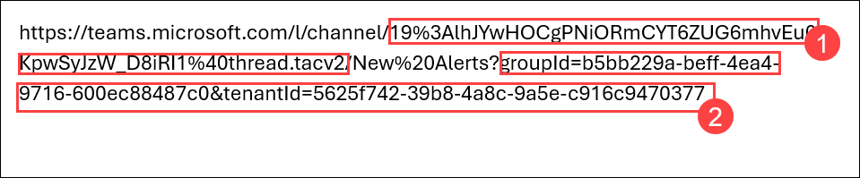

    <validation step="f4206fb0-ae39-456e-9b25-4c6c6a19a440" />

    > **Congratulations** on completing the task! Now, it's time to validate it. Here are the steps:
    > - Click the Lab Validation tab located at the upper right corner of the lab guide section and navigate to the Lab Validation tab.
    > - Hit the Validate button for the corresponding task.
    > - If you receive a success message, you can proceed to the next task. If not, carefully read the error message and retry the step, following the instructions in the lab guide.
    > - If you need any assistance, please contact us at labs-support@spektrasystems.com. We are available 24/7 to help you out.

### Task 4: Create a Playbook in Microsoft Sentinel.

In this task, you will create a Logic App that is used as a Playbook in Microsoft Sentinel.

1. In the Microsoft Edge browser, open a new tab and paste https://github.com/Azure/Azure-Sentinel to navigate to Microsoft Sentinel on GitHub.

1. Scroll down and select the **Solutions** folder.

1. Next select the **SentinelSOARessentials** folder, then the **Playbooks** folder.

1. Select the **Post-Message-Teams** folder.

1. In the readme.md box, scroll down to the *Quick Deployment* section, **Deploy with incident trigger (recommended)** and select the **Deploy to Azure** button.

   

1. Make sure your Azure Subscription is selected.

1. For Resource Group, select **threat-xdr** and select **OK**.

1. Leave **(US) East US** as the default value for *Region*.

1. Rename the *Playbook Name* to **PostMessageTeams-OnIncident** and select **Review + create**.

1. Now select **Create**.

   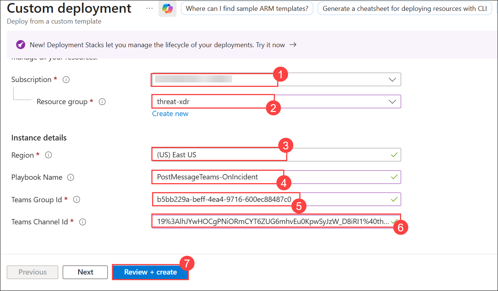

   >**Note:** Wait for the deployment to finish before proceeding to the next task. It may take a couple of minutes to deploy.

### Task 5: Update a Playbook in Microsoft Sentinel.

In this task, you will update the new playbook you created with the proper connection information.

1. In the Search bar of the Azure portal, type *Sentinel*, then select **Microsoft Sentinel**.

1. Select your Microsoft Sentinel Workspace **loganalyticworkspace**.

1. Select the **Automation** from the Configuration area and then select the **Active Playbooks** tab, If **PostMessageTeams-OnIncident** is not visible refresh the page and check.

1. Select the **PostMessageTeams-OnIncident** playbook and click on it to go to the logic App page.

    

1. On the Logic App page for *PostMessageTeams-OnIncident*, in the center menu, select **Edit**.
   
    

1. Select the *first* block **Microsoft Sentinel Incident**.

1. Select the **Change connection** link.
   
    

1. Select **Add new** and select **Sign in**. In the new window, select your Azure subscription admin credentials when prompted. The last line of the block should now read “Connected to your-admin-username”.

1. Now select the *second block*, **Change Connections** and click **Sign in**.

   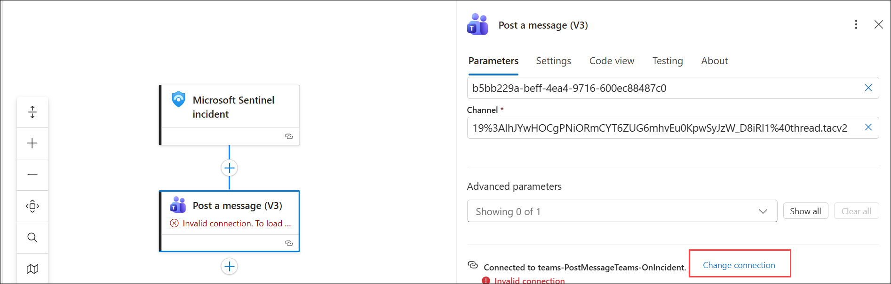

1. Select **Add new** and select your Azure admin credentials when prompted. The last line of the block should now read “Connected to your-admin-username”.
   
    

1. The block has now been renamed to **Post a message (V3)**, at the end of the Team field, select the X to clear the contents. The field is changed to a drop-down with a listing of the available Teams from Microsoft Teams. Select **SOC**.

1. Do the same for the Channel field, select the **X** at the end of the field to clear the contents. The field is changed to a drop-down with a listing of the Channels of the SOC Teams. Select **New Alerts**. 

1. Under the **Message** section, type **Entities: (1)** and select **Entities (2)** dynamic content from the right panel.

   

   

1. Select **Save** on the command bar. The Logic App will be used in a future lab.
   
   
   
### Task 6: Onboard a Device

In this task, you will onboard a device to Microsoft Defender for Endpoint using an onboarding script.

1. If you are not already at the Microsoft 365 Defender portal in your browser, start the Microsoft Edge browser go to (https://security.microsoft.com).

1. On the **Sign into Microsoft Azure** tab, you will see the login screen. Enter the following **Email/Username**, and then click on **Next**.

   **Email/Username**: <inject key="AzureAdUserEmail"></inject>

     

1. Enter the following **Password** and click on **Sign in**. 
   
    **Password**: <inject key="AzureAdUserPassword"></inject>

     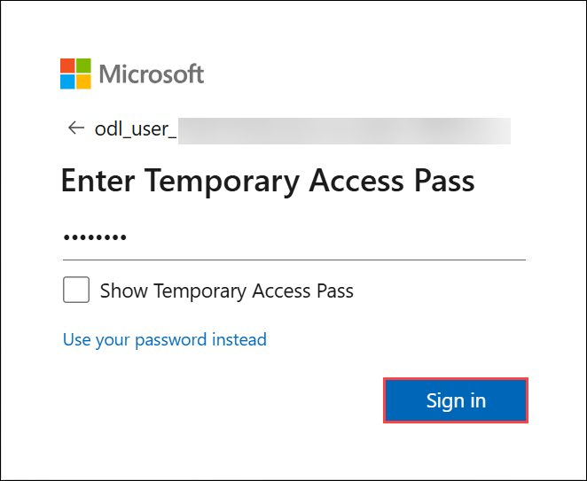 

    >**Note:** Take a moment to allow the option panel to fully load on the security portal.

1. Navigate to **Assets** from left panel and click on **Devices** and, wait for few minutes to get loaded once loading completed refresh the page.

1. Navigate to **Settings** in the left menu bar, and then, on the Settings page, choose **Endpoints**.

   

   >**Note:** If you do not see the Endpoints option under Settings, log out by selecting the top-right circle with your account initials and select Sign out. Other options that you might want to try are to refresh the page with Ctrl+F5 wait for 30-45 minutes or open the page InPrivate. Login again with the Tenant Email credentials.

1. Navigate to the **Onboarding** option in the Device Management section.

    >**Note:** Device onboarding can also be initiated from the **Assets** section on the left menu bar. Expand 'Assets' and choose 'Devices.' On the Device Inventory page, with 'Computers & Mobile' selected, scroll down to find the option for **Onboard devices.** Clicking on this option will direct you to the **Settings > Endpoints** page.

1. In the Onboard a device' section, ensure that 'Local Script (for up to 10 devices)' is visible in the Deployment method drop-down, then click the **Download onboarding package** button.

    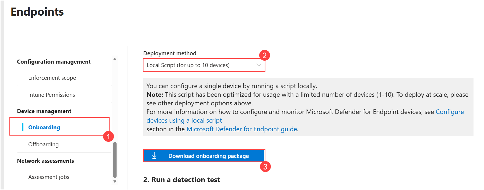 

1. In the *Downloads* pop-up, use your mouse to select the 'WindowsDefenderATPOnboardingPackage.zip' file, and then click on the folder icon for **Show in folder**. **Hint:** If you can't locate it, the file should be in the 'c:\users\admin\downloads' directory.

   

1. Right-click on the downloaded zip file, choose **Extract All...**, ensure that **Show extracted files when complete** is checked, and then click **Extract**.

    

1. Right-click on the extracted file 'WindowsDefenderATPLocalOnboardingScript.cmd' and choose **Properties**. Tick the **Unblock** checkbox located in the bottom right of the Properties window, and then click **OK**.

    

1. Once again, right-click on the extracted file **WindowsDefenderATPLocalOnboardingScript.cmd** and opt for **Run as Administrator**. **Hint:** If the Windows SmartScreen window appears, click on **More info**, and then select **Run anyway**.
    
1. When the "User Account Control" window appears, select **Yes** to allow the script to run, answer **Y** to the question presented by the script, and press **Enter**. Once complete, you should see a message in the command screen that says *Successfully onboarded machine to Microsoft Defender for Endpoint*.

1. Press any key to continue. This action will close the Command Prompt window.

   

1. Back on the Onboarding page within the Microsoft 365 Defender portal, navigate to the "2. Run a detection test" section, and copy the detection test script by clicking the **Copy** button.

    

1. In the Windows search bar of the virtual machine, type **CMD**, and choose **Run as Administrator** from the right pane for the Command Prompt app.

1. When the "User Account Control" window appears, select **Yes** to allow the app to run. 

1. Paste the script by right-clicking in the **Administrator: Command Prompt** window and press **Enter** to run it. **Note:** The window closes automatically after running the script.

1. In the Microsoft 365 Defender portal, navigate to the left-hand menu, and under the **Assets** area, select **Devices**. If the device is not shown, proceed with the next task and return to check it later. It can take up to 60 minutes for the first device to be displayed in the portal.

    

## Summary

In this lab, you integrated a Logic App with Microsoft Sentinel and Microsoft Defender for Cloud to automate threat protection and responses. You connected the Windows Security Event connector, enabled Defender for Cloud, and created a Security Operations Center (SOC) team in Microsoft Teams. You also developed and updated a playbook in Sentinel to automate incident response workflows and onboarded a device to Microsoft Defender for Endpoint. This lab demonstrated how to configure and automate threat detection and response using Logic Apps, Sentinel, and Defender for Cloud.

## You have successfully completed the lab
